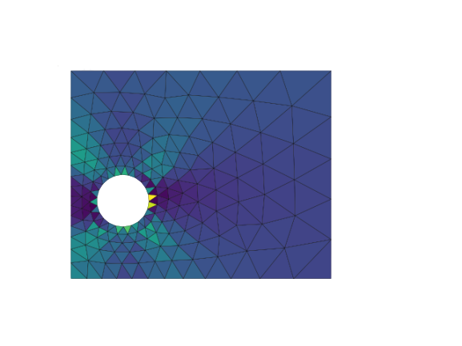




<!-- PROJECT SHIELDS -->
<!--

-->
[![Code Size][codesize-shield]][codesize-url]
[![Stargazers][stars-shield]][stars-url]
[![Issues][issues-shield]][issues-url]
[![version][version-shield]][release-url]
[![commits][commits-shield]][commits-url]
[![LinkedIn][linkedin-shield]][linkedin-url]

<!-- PROJECT LOGO -->
<br />
<p align="center">
  <a href="https://github.com/azzeddinetiba/FeCLAP">
    
  </a>

  <h3 align="center">FeCLAP</h3>

  <p align="center">
    A simple solver for laminate composite plates
    <br />
    <a href="https://github.com/azzeddinetiba/FeCLAP"><strong>Explore the docs »</strong></a>
    <br />
    <br />
    <a href="https://github.com/azzeddinetiba/FeCLAP">View Demo</a>
    ·
    <a href="https://github.com/azzeddinetiba/FeCLAP/issues">FeCLAP Bug</a>
    ·
    <a href="https://github.com/azzeddinetiba/FeCLAP/issues">Request Feature</a>
  </p>
</p>


<!-- TABLE OF CONTENTS -->
## Table of Contents

* [About the Project](#about-the-project)
* [Getting Started](#getting-started)
  * [Prerequisites](#prerequisites)
  * [Installation](#installation)
* [Usage](#usage)
* [Roadmap](#roadmap)
* [Contributing](#contributing)
* [Contact](#contact)
* [Acknowledgements](#acknowledgements)


<!-- ABOUT THE PROJECT -->
## About The Project

[![Product Name Screen Shot][product-screenshot]]()

This is a personal project small solver for the **F**inite **e**lement analysis of **C**omposite **LA**minate **P**lates = **_FeCLAP_** for rectangular geometries.
This solver supports **static, modal, transient and non linear analysis** using a perfectly elasto-plastic model.
Only triangular mesh from _distmesh_ is available, and only rectangular geometries.
The plastic model used is based on a Tsai-Hill yield function, with no plastic hardening.

<!-- GETTING STARTED -->
## Getting Started

To get a local copy up and running follow these simple steps.
See [Usage](#usage) for using the solver.

### Prerequisites

This project requires the following libraries:
* Cython
```sh
pip install cython
```

* Numpy
```sh
pip install numpy
```

* Scipy
```sh
pip install scipy
```

* Eigency
```sh
pip install rmjarvis.eigency
```

* distmesh \
_Instead of installing via pip, we recommend icnluding the distmesh source code folder into the remaining FeCLAP folder, avoiding thus Lapack incompatibility issues._

### Installation
 
* Clone the FeCLAP
```sh
git clone https://github.com/azzeddinetiba/FeCLAP.git
```

* Install the required packages

* Delete _FeCLAP\NonLinearModule\NonLinearModule.cpp_

* Build the NonLinearModule (this build uses Cython and C++)
```sh
python setup.py build
python setup.py install
```
* Create and add to *FeCLAP\NonLinearModule\\* or *FeCLAP\NonLinearModule-1.0-py3.8-win-amd64.egg\NonLinearModule\\*
the file ```\__init__.py``` (Folder names vary depending on the python version, and the environment used) with:
```python
from .NonLinearModule import * 
```
The program needs ffmpeg installed (change the directory where ffmpeg is installed in line **12** in *Main.py*) to save mode shapes animations.
<!-- USAGE EXAMPLES -->
## Usage

The solver is used by running **_Main.py_** and the user can follow the instructions on how to input the model data.
The result files and plots will be stored in the directory _Results_.

To use the binary version, donwnload [*_FeCLAP_*](https://github.com/azzeddinetiba/FeCLAP/releases/tag/1.1.0) for the FeCLAP v1.1.0 and run _Main.exe_ (Some animation features could not work properly)

**_test_examples.py_** includes 3 example cases, these could be solved simply by running the script, the results generated will be stored in the **_Example_Cases_Results_** Directory, and replace the existing reference results. So make sure you store those files to compare later.
(Remember to exit the generated figures to allow the script to keep running). The text file for the first case results however will be stored in the main **_Results_** Directory 

_For more info, Please refer to the [Documentation]( ) (Under construction)_

<!-- Screenshots -->
## Screenshots
Here are some screenshots for some results gotten from this code.
[![screen1][Screen1]]()

[![screen2][Screen2]]()

[![screen3][Screen3]]()

[![screen4][Screen4]]()

[![screen5][Screen5]]()

[![screen6][Screen6]]()

[![screen7][Screen7]]()


<!-- ROADMAP -->
## Roadmap

See the [open issues](https://github.com/azzeddinetiba/FeCLAP/issues) for a list of proposed features (and known issues).


<!-- CONTACT -->
## Contact

TIBA Azzeddine - [Portfolio](https://portfolium.com/AzzeddineTiba/portfolio) - azzeddine.tiba@gmail.com

Project Link: [FeCLAP Github Link](https://github.com/azzeddinetiba/FeCLAP)


<!-- ACKNOWLEDGEMENTS -->
## Acknowledgements

* [P.-O. Persson, G. Strang, A Simple Mesh Generator in MATLAB. SIAM Review, Volume 46 (2), pp. 329-345, June 2004](https://github.com/bfroehle/pydistmesh)

<!-- REFERENCES -->
## References

* [KRISTIAN KRABBENHØFT, BASIC COMPUTATIONAL PLASTICITY, June 2002](http://homes.civil.aau.dk/lda/continuum/)
* Experimental imposed plastic displacement. Powell, G. and Simons, J. (1981), Improved iteration strategy for nonlinear structures. Int. J. Numer. Meth. Engng., 17: 1455-1467. doi:10.1002/nme.1620171003


<!-- MARKDOWN LINKS & IMAGES -->
<!-- https://www.markdownguide.org/basic-syntax/#reference-style-links -->
[codesize-shield]:  https://img.shields.io/github/languages/code-size/azzeddinetiba/FeCLAP
[codesize-url]: https://github.com/azzeddinetiba/FeCLAP/tree/master/src_code
[stars-shield]: https://img.shields.io/github/stars/azzeddinetiba/FeCLAP.svg?style=flat-square&color=yellow
[stars-url]: https://github.com/azzeddinetiba/FeCLAP/stargazers
[issues-shield]: https://img.shields.io/github/issues/azzeddinetiba/FeCLAP.svg?style=flat-square
[issues-url]: https://github.com/azzeddinetiba/FeCLAP/issues
[license-shield]: https://img.shields.io/github/license/othneildrew/Best-README-Template.svg?style=flat-square
[linkedin-shield]: https://img.shields.io/badge/-LinkedIn-blue.svg?style=plastic&logo=linkedin
[commits-shield]: https://img.shields.io/github/commits-since/azzeddinetiba/FeCLAP/v0.2?color=lightgreen&style=plastic
[commits-url]: https://github.com/azzeddinetiba/FeCLAP/commits
[linkedin-url]: https://www.linkedin.com/in/azzeddine-tiba/
[release-url]: https://github.com/azzeddinetiba/FeCLAP/releases/
[product-screenshot]: logo/hoffman.png
[version-shield]: https://img.shields.io/github/v/release/azzeddinetiba/FeCLAP?color=orange
[Screen1]: logo/Hoffmancriterion.png
[Screen2]: logo/Modal_Screenschot.PNG
[Screen3]: logo/Straineyy(Oy).png
[Screen4]: logo/StressThick.png
[Screen5]: logo/TransientAnal.png
[Screen6]: logo/TransDisp.png
[Screen7]: logo/NLN.png
